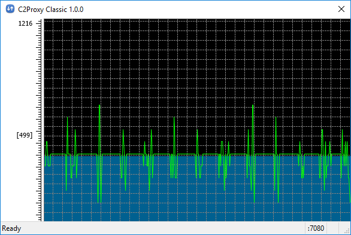

C2Proxy
=======
-- a __relayed__ HTTP Proxy program.

Overview
--------

* It is a relayed HTTP proxy program.  
Yes, it works like CNTLM with a friendly GUI which help the end user.
* It can work with the upstream HTTP proxy which requires username/password authentication, then proxy the downstream programs which are not required or supported username/password authentication.

Screen Shot
-----------

* Main Window  

* Settings  

Download Links
--------------

* A portable [program](./C2Proxy_1.0.0.7z) for Windows win32/x86.
* A main window [screen shot](./C2Proxy_main.png) while it is running.
* A very simple [user guide](./Help.html).  
yes, it is this page.
