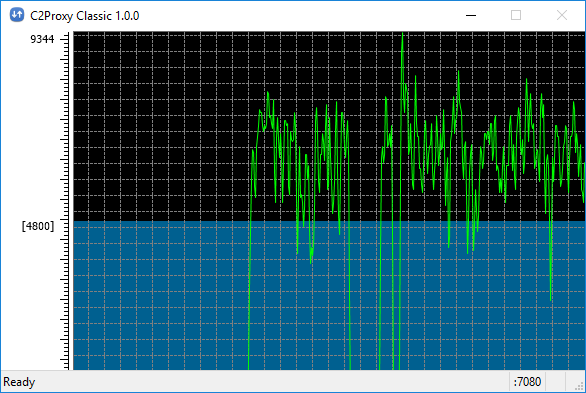

C2Proxy
=======
-- a __relayed__ HTTP Proxy program.

Overview
--------

* Here is a 
* It is a relayed HTTP proxy program.
  Yes, it works like CNTLM with a friendly GUI which help the end user.
* It can work with the upstream HTTP proxy which requires username/password authentication, then proxy the downstream programs which are not required or supported username/password authentication.

Download Links
--------------

* A portable [program](https://github.com/zhengfish/release/blob/master/C2Proxy/1.0/C2Proxy_1.0.0.7z) for Windows win32/x86.
* A [screen shot](https://github.com/zhengfish/release/blob/master/C2Proxy/1.0/C2Proxy_ScreenShot.png) of one common use case..
* A very simple [user guide](https://github.com/zhengfish/release/blob/master/C2Proxy/1.0/Help.html). yes, it is this page.
