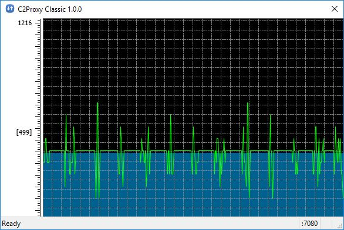

C2Proxy
=======
-- a __relayed__ HTTP Proxy program.

Overview
--------

* It is a relayed HTTP proxy program.
Yes, it works like CNTLM but with a friendly GUI which help the end user.
* It can work with the upstream HTTP proxy which requires username/password authentication, then proxy the downstream programs which are not required or supported username/password authentication.

Platform
--------

* Windows
On Windows, it will run as a application with one GUI from one trayicon.
The end user can configure the parameters in GUI setting window.
* Linux/Ubuntu
On Ubuntu, it will run as a daemon without any GUI.
The end user need to configure the username/password in /etc/c2proxy.json beforehand.

Screen Shot
-----------

* Main Window on Windows

* Settings

Download Links
--------------

* A portable program [v1.0.0](./C2Proxy_1.0.0.7z) for Windows win32/x86.
* A main window [screen shot](./C2Proxy_main.jpg) while it is running.
* A very simple [user guide](./Readme.md).
Yes, it is this page.
